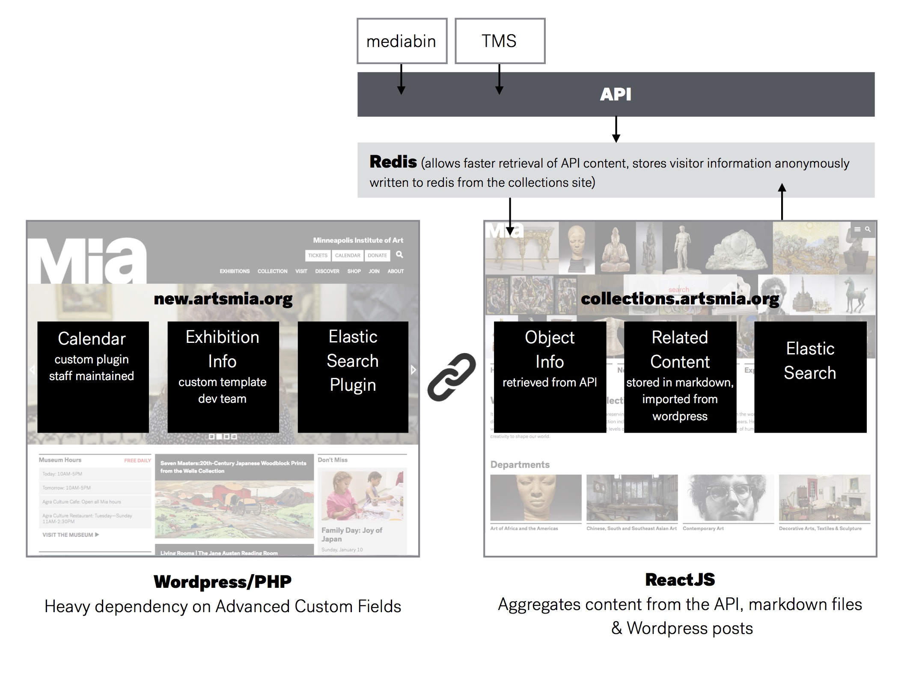
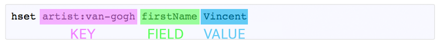
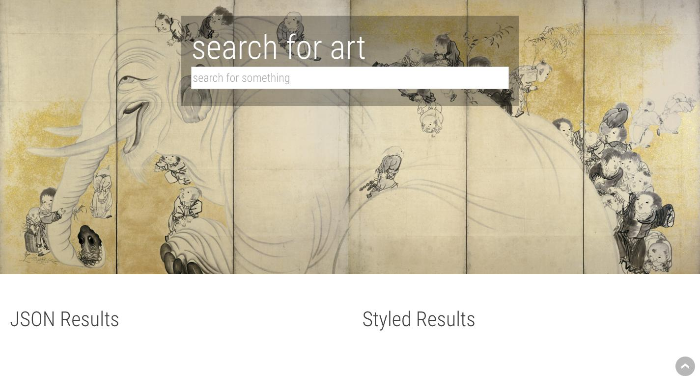

# Anything In, Anything Out

**Dynamic Data Aggregation + Web Publishing**

???

(This readme does double duty as a slideshow. Headers and `---` denote
slides, text following `???` within a slide is the 'presenter notes' for
that slide)

---

## Introductions

We are the 'software' team at the Minneapolis Institute of Art

* Andrew David
* Misty Havens
* Kjell Olsen

You:

* Where are you from?
* What are you hoping to learn
* Favorite object from your collection.

???

We take data, convert it to JSON, store it in Redis, index it in ElasticSearch and then publish it for the masses. We're here to show you how...

Workshop attendee intros

---

# Lesson 1: Where does data come from?


### Introduction to data at Mia.



???

Data lives in different places and formats. For this workshop we will focus on collections data.

### Converting data into JSON.

[JSON](http://www.json.org/) is a swiss army knife data representation. It's replaced
XML as the common-denominator format of data returned from APIs.


---

```
{
  "accession_number": "2015.79.83.1",
  "artist": "Ogata Kenzan",
  "continent": "Asia",
  "country": "Japan",
  "creditline": "Mary Griggs Burke Collection, Gift of the Mary and Jackson Burke Foundation",
  "culture": null,
  "dated": "first half 18th century",
  "department": "Japanese and Korean Art",
  "description": "pink, red, and white hollyhocks in various stages of blossom; bottom stems of blossoming hollyhocks also in ULQ",
  "dimension": "43 1/2 × 113 in. (110.49 × 287.02 cm) (image)\r\n45 × 114 1/2 × 5/8 in. (114.3 × 290.83 × 1.59 cm)",
  "id": "122147",
  "image": "invalid",
  "image_copyright": "",
  "image_height": "",
  "image_width": "",
  "inscription": "Signature and Seal",
  "life_date": "Japanese, 1663 - 1743",
  "markings": "LLC red artist\\'s seal: {Reikai}",
  "medium": "Ink and color on gilded paper",
  "nationality": "Japanese",
  "provenance": "Prince Komatsu",
  "restricted": 0,
  "rights_type": "Public Domain",
  "role": "Artist",
  "room": "G219",
  "signed": "LLC: (Painted by the Eremite from the Flowering Capital Shisui Shinsei at age 81)",
  "style": "18th century",
  "text": "",
  "title": "Hollyhocks"
}
```

???

"artisinal json": have attendees hand-build a JSON representation of
what their API would look like
They could use their favorite object as an example. Or pull actual json they currently use at their institution.

## Setup

We've prepared an AWS machine for everyone to use with the required data
and tools at the ready.

You'll need to open a terminal and use `ssh` to connect to it:

Check your email for the .pem file, if you haven't received it let us know.

`ssh -i mw2016.pem ubuntu@<ip address>`

If you want, you can `git clone` this repository and follow along on your
local machine.

# Lesson 2: Fun with Redis!

### What is Redis?

[Redis](http://redis.io) is a key value store that is fast and flexible. It does simple `key: value` mappings, but beyond that it is also a "data structure store", optimized to handle different types of data quickly and effectively.

---

The basics:

* lets start by connecting to the redis-cli so we can talk directly to Redis.

`redis-cli`

If all goes well you'll see the command line prompt below. It is from here we will issue the rest of the commands to Redis.

`127.0.0.1:6379>`

## Strings

store a single value with the key used to retrieve it

`set name kjell` or

`set day wednesday!`

`set json '{"aJson: {"object": true}}'`

string values can be retrieved with the `get` command

```
127.0.0.1:6379> get day
"wednesday!"
```

???

keys can be named anything. Here we're using simple key names, but using
`:` is a redis naming convention to allow for more specificity

## Hashes

store multiple *fields* behind a single key:

```
hset artist:van-gogh firstName Vincent
hset artist:van-gogh lastName "Van Gogh"
```



---

`hmset` can set multiple hash values in one command:

`hmset artist:van-gogh birth "30 March 1853" death "29 July 1890"`

---

So now our data for Van Gogh looks like:

```
> hgetall artist:van-gogh
1) "firstName"
2) "Vincent"
3) "lastName"
4) "Van Gogh"
5) "birth"
6) "30 March 1853"
7) "death"
8) "29 July 1890"
```

Try adding an artist to your local redis database.

---

a **set** is a list of things. Let's use one to index our artists:

`sadd artists artist:van-gogh` adds "Van Gogh" to new set called artists.

Then add the artist you created.

---

You can use this list to keep track of all the artists you've stored in
redis.

```
127.0.0.1:6379> smembers artists
1) "artist:van-gogh"
2) "artist:monet"
...
```

For example, an API endpoint to return all artists would

1. ask redis for all artist keys (`smembers artists`)
2. ask redis for the information stored in each artist's record
   (`artists.map { |artist| hgetall artist:id }`)
3. Transform that information into JSON

```
{
  "van-gogh": {
    "firstName": "Vincent",
    "lastName": "Van Gogh",
    ...
  },
  "monet": {
    ...
  }
}
```

## Understanding Key Value stores, and how to make them work for you.

Deciding on a structure for your data in Redis is the hardest part.

For representing museum object data, the simplest solution would be to
store information about each object using the object `id` as a key. So
to look up information on `17`, I would say to redis:

```
> get object:17
"{\"id\":\"17\",\"title\":\"Sketch made on Indian Reservation, Montana\",\"medium\":\"Graphite\",…}"
```

???
But as the size of the `object:` keys grows, it takes longer and longer
for redis to keep things organized. This is where the *data structure*
part of redis comes into play.

To get around the issues of saving thousands of `key: value` pairs,
we group artworks by their object id and store them in a series of
hashes. Hashes are much more memory efficient [Redis Opimizations](http://redis.io/topics/memory-optimization).

To store our hashes we organize them in "**buckets**". Artworks are sorted into buckets
according to their object ID. The first 1000 go into "bucket 0", the
next 1000 go into "bucket 1" and so on.  This helps improve the memory footprint and keeps retrieval time down.

---

To make it easy to know which bucket an object goes in, we use the
object id divided by 1000 to assign buckets.

| Object ID | Bucket |
| ---  | --- |
| `id` | `id / 1000` |
| 278 | 0 |
| 1218 | 1 |
| 60728 | 60 |

Each bucket is stored in a redis hash and associated with its unique object id. Here's how to get the info on object
60728:

```
> hget object:60 60728
"{\"id\":\"60728\",\"title\":\"Celestial Horse\",\"medium\":\"Bronze with traces of polychrome\", <... lots of JSON>}"
```
---

### Take a look

Speaking of how we use redis, we've loaded your redis with our metadata!

```
127.0.0.1:6379> hget object:0 0
"{\"id\":\"http:\\/\\/api.artsmia.org\\/objects\\/0\",
\"title\":\"Air, from the series The Four Elements\",
\"medium\":\"Pen and ink, brush and wash over graphite\",
\"dimension\":\"68-5\\/8 x 25-1\\/8 in. (174.3 x 63.8 cm)\",
\"continent\":\"Europe\",
\"country\":\"England\",
\"culture\":null,
\"dated\":\"c.1888-89\",
\"room\":\"Not on View\",
\"style\":\"19th century\",
…
}"
```

(JSON formatting slightly altered)

---

### Correlating data

Here's an example of how to connect two things in redis.

```
127.0.0.1:6379> smembers object:529:tags
1) "lucretia"
2) "rembrandt"
3) "washington-dc"
4) "crime"
5) "ancient-rome"
7) "netherlands"
8) "national-gallery-of-art"
9) "roman-historian"
10) "roman-mythology"
11) "visual-arts"
13) "europe"
14) "sextus-tarquinius"
15) "william-hood-dunwoody-fund"
17) "oil-on-canvas"
```

---

```
127.0.0.1:6379> smembers tag:dutch
1) "1944"
2) "7459"
3) "53233"
4) "53236"
5) "54238"
6) "54565"
7) "54650"
8) "55111"
9) "529"
```

???

Now that we have a data structure and it is set up in a structure that allows for quick access we can explore creating relationships between keys.

---

We use this for two purposes in our own data structure.

1. To create a tag index of objects.
2. To allow various web interfaces to write connections directly to Redis, for example a user can collect objects to create a tour or collect their favorite artworks.

---

Try it!

```
hgetall object:112 112663
```

You can see the json data associated with the object.

```
smembers object:112663:tags

sadd object:112663:tags circus
sadd tags:circus 112663

smembers object:112663:tags
smembers tags:circus
```

???

Note that this relationship needs to be created twice:

'circus' is added to the set of `tags` for `object:112663`, and
'112663' is added to the set of objects with `tags:circus`

For both the object and the tag to know they're connected, the link has
to be made on both sides.

---

# Questions?


---

### Redis doesn't do search.

It's great for storing data and accessing it quickly, but redis needs
know exactly what you're looking for.

[Elasticsearch](https://www.elastic.co/products/elasticsearch) is a tool
for *information retrieval*. It's great at finding things.

---

# Lesson 3: Indexing and searching data

(Or, **Where did I put my keys?!**)

### Indexing

Elasticsearch uses something called an [**inverted
index**](https://www.elastic.co/guide/en/elasticsearch/guide/current/inverted-index.html)
to to build a searchable representation of a set of **documents**.

???

It breaks the documents given to it down into their component words
(analysis), then stores those words in an index along with a link to the
documents containing them.

---

#### Analysis

The default analyzer (`standard`) *tokenizes* the full string into one
or more tokens (words), then lowercases each of those words and removes
common *stopwords* such as "the", "with", and "as":

"Chariot Finial with Bird" => `chariot finial bird`

adding a few more documents,

1: "Chariot Finial with Bird" => …  
2: "Xi Bi Disc" => `xi bi disc`   
3: "Bi Scabbard Chape" => `bi scabbard chape`   
4: "Bi (Ceremonial Disk Symbolizing Heaven)"  
=> `bi ceremonial disk symbolizing heaven`  
5: "Bi (Cermonial Disk Symbolizing Heaven)"  
=> `bi cermonial disk symbolizing heaven`   

---

#### Indexing

Once ES analyzes all the documents to obtain a list of words, it stores
those terms with a list of documents containing them (an inverted
index).

It will look something like the next slide

---

| term | document ids |
| --- | --- |
| chariot | 1 |
| finial | 1 |
| bird | 1 |
| xi | 2 |
| bi | 2, 3, 4, 5 |
| disc | 2, 4, 5 |
| scabbard | 3 |
| chape | 3 |
| ceremonial | 4 |
| cermonial | 5 |
| symbolizing | 4, 5 |
| heaven | 4, 5 |

```
1: Chariot Finial with Bird  
2: Xi Bi Disc  
3: Bi Scabbard Chape  
4: Bi (Ceremonial Disk Symbolizing Heaven)  
5: Bi (Cermonial Disk Symbolizing Heaven)  
```

???

Elasticsearch responds to a search by breaking it into individual
words, and matching those words to documents using this inverted index.

So a search for 'bi' would match documents 2, 3, 4, 5.

'bi AND heaven': 4, 5

'xi AND bi': 2

'xi OR bi': 2, 3, 4, 5 (note, here 2 is unequivocally the "top" hit
because it contains both of the searched terms, where 3,4,5 only contain
1)

'bi AND disc': 2, 3, 5, 4

### Documents, mapping, analysis

Elasticsearch uses a very flexible indexing process. When it gets new
information, it tried to guess what that information is comprised of.

For instance, our representation of Van Gogh from earlier contained two
strings for name (first, last) and two dates (birth, death).

Elasticsearch needs to know that the name fields are of type string and
the date fields are type date.

???

Elasticsearch can infer some data types, such as strings and numbers.

Mappings can also be specified when creating an index. These mappings
can specify advanced analysis of a field.

---

#### A few examples of mappings we use:

Don't tokenize accession numbers ("L2011.43.6.a-b")

`"accession_number": { "type": "string", "index": "not_analyzed" }`

Analyze `title` in multiple, complimentary ways:

```
"title": {
  "type": "string",
  "analyzer": "snowball",
  "fields": {
    "raw": { "type": "string", "index": "not_analyzed" },
    "ngram": {"type": "string", "analyzer": "ngram" },
    "sort": {"type": "string", "analyzer": "lowercase_sort"}
  }
}
```

???

1. Don't analyze accession numbers. `L2011.43.6.a-b` should be indexed
exactly like that and not broken up into tokens.

2. This indexes `department` twice: once with the standard settings, and
then again as `department.raw` as an un-alayzed string.

3. For artwork titles, index them with the "snowball" analyzer by
   default. Index 3 subfields, "raw" as an untouched string, "ngram" for
   searching on parts of words, and sort

"Snowball" does stemming: `horses` => `horse`

# Lesson 4: Getting data out and displaying data

---



???

Included in this repository is a simple php site that allows you to enter a search term and then renders the full JSON found in Redis via ElasticSearch and a styled version of the same data.

Examples of the benefits of mappings. -- KO

Favoriting and seeing the data in redis. --MH

---

### Allowing your web interface to write to Redis.

Select a few objects to save to a set by clicking the heart.

You can then go back to your terminal and run `smembers user:01:faves`

And you will see the object ids you collected.

---

# In Conclusion

---

# JSON is the MacGyver of data formats.


---

# Redis is fast and allows for data storage and data manipulation.

???
Easy access, Fast retrieval and ability to allow web interfaces to manipulate, connect and enhance data.

---

# ElasticSearch is flexible and customizable.

???
Being able to customize your own index is a sure way to keep curators and visitors happy.

---

# Publishing made simple.

???
We use PHP and React JS along with various other programming languages to build our public facing sites, internal tools and apps, but the system behind them is the same. Web publishing can be easier even when data is spread across multiple platforms and places.

---
# Resources

Redis.io

[JSON Lint](http://jsonlint.com/) Excellent JSON validation tool.

---
# Thanks!
**
Andrew David, adavid@artsmia.org
Kjell Olsen, kolsen@artsmia.org
Misty Havens, mhavens@artsmia.org
**
???
We hope you enjoyed this session as much as we did!
